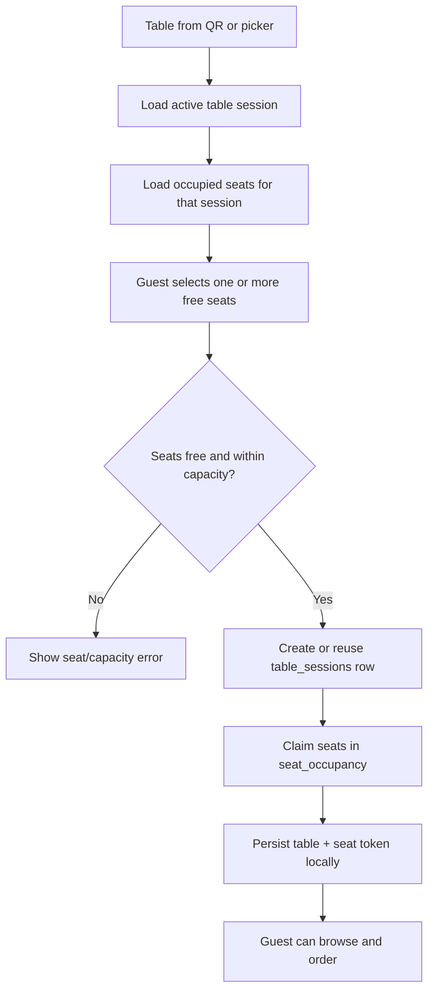

# Zappy QR Flow

This document describes the current end-to-end QR dining flow: configuration by restaurant staff, scan routing, guest table/seat activation, ordering, billing, and session cleanup.

## 1. QR setup (staff)

1. In **Enterprise QR Center** or **QRCodeManager**, staff create a table with a number and capacity.
2. Creating a table stores a `tables` row (`restaurant_id`, `table_number`, `capacity`, `status: available`, `is_active: true`).
3. The UI creates (or repairs) a dynamic `qr_codes` row for that table:
   - `qr_name`: `Table <table number>`
   - `target_url`: `/order?r=<restaurant UUID>&table=<table number>`
   - `metadata.table_id` and `metadata.table_number`
4. The QR artwork encodes the public redirect URL: `https://<app>/r/<qr-code UUID>` for dynamic QRs. A restaurant-level base QR may instead target `/order?r=<restaurant UUID>` and lets the guest choose a table.
5. Staff can customize, download, deactivate, or delete QR records. Deleted/archived tables are made inactive; their dependent QR is also removed by the management UI.

## 2. Scan and redirect

```mermaid
sequenceDiagram
  participant G as Guest phone
  participant R as /r/:id (QRRedirect)
  participant DB as Supabase
  participant M as CustomerMenu (/order or /menu)

  G->>R: Scan dynamic QR
  R->>DB: Read qr_codes by UUID
  alt missing or inactive QR
    R-->>G: QR unavailable screen
  else valid QR
    R->>DB: Insert scan_analytics; increment_scan_count()
    R->>M: Navigate to target_url (preserving query parameters)
  end
```

The client redirect route validates that the QR id is a UUID, verifies that the QR is active, detects device/browser metadata, logs the scan, increments `qr_codes.scan_count`, then navigates after a short delay.

The deployed `qr-redirect` Edge Function supports the same redirect model for `?id=<uuid>` or a path id. It additionally rate-limits by forwarded IP (100 scans/minute), rejects missing/inactive/expired QRs, logs analytics, atomically increments the count, and returns an HTTP 302.

## 3. Menu boot and table resolution

1. `CustomerMenu` reads `r` (restaurant id) and `table` (table number) from the URL.
2. It resolves the table number to an active `tables` row scoped to that restaurant.
3. It also restores a previously selected table from `localStorage` when applicable:
   - `qr_table_<restaurantId>`
   - `zappy_seat_session_<restaurantId>_<tableNumber>` (expires after 4 hours)
4. A table QR opens the seat picker directly. A base QR with no table opens the table picker first; only active tables are shown.
5. Once a table is resolved, the menu logs an organic scan to `qr_scan_logs` and subscribes to relevant real-time changes.

## 4. Seat selection and dining-session activation



On confirmation, the menu checks selected seats against the live `seat_occupancy` result and checks the table capacity. If there is no active table session, it creates a `table_sessions` row with `status: seated` and `seated_at`. It marks the table `occupied` and records seat claims in `seat_occupancy`.

The first claimed `seat_occupancy.id` becomes the guest's `seatSessionId`. That opaque UUID, rather than a seat number or local array, is carried through the order and billing flow. The browser persists it with the selected seats and a four-hour TTL. If the underlying session no longer exists, the UI clears the local seat session; if a table is known but no valid seat session exists, it forces seat selection again.

`seat_occupancy` is the source of truth for per-seat use. Its active records contain `restaurant_id`, `table_id`, `table_session_id`, `seat_number`, `status`, and optionally `order_id`. Seat availability is refreshed through Supabase Realtime.

## 5. Ordering

1. The guest adds menu items to the cart and submits the order.
2. Ordering is blocked until an active table session is available (except demo mode).
3. The order is created with both session identifiers:
   - `table_session_id`: the table-wide dining session
   - `seat_session_id`: the guest's `seat_occupancy.id`
   - `seat_number`: the guest's first selected seat
   - `token_no`, table/restaurant ids, customer details, and an idempotency key
4. The corresponding `table_sessions` row is updated to `status: ordering`, with `order_id` and `order_placed_at`.
5. The guest's Orders and billing views filter session orders by exact `seat_session_id`, preventing cross-talk between different seats at the same table.

## 6. Service, billing, payment, and completion

1. Guests can call a waiter or request a bill. Bill requests create a pending `waiter_calls` row for the table and first selected seat.
2. Billing Counter handles billing only: it marks the selected order paid and creates the invoice. It does not complete a table session, release seats, change table state, or emit a session-close event.
3. Once the invoice is paid, the guest receives a receipt. A returning customer identified by an existing device/profile id skips review; a newly registered customer with a name must submit a review before continuing. The thank-you screen then presents **End Session**; there is no payment action on that button and no countdown/automatic session close.
4. **End Session** is the customer-owned completion action. It calls `SessionLifecycleService.completeSession()` with the table-session id, then clears the cart, local table/seat-session storage, in-memory seat session, and menu access. The terminal Thank You screen remains locked in place; only a newly scanned dynamic QR writes the one-time scan marker that starts another session.
5. Admin **Kill Session** and customer **End Session** both call the same tenant-scoped `SessionLifecycleService.terminateSession()` operation. The admin path emits `session_terminated`; the customer path emits `session_closed`.
6. `SessionLifecycleService.completeSession()` performs the final cleanup:
   - updates `table_sessions.status` to `completed` and sets `completed_at`;
   - changes that session's occupied seats to `available` and clears `order_id`;
   - sets `tables.status` to `needs_cleaning`;
   - resolves pending waiter calls for the table;
   - writes a `customer_events` `session_closed` event.
7. `forceCloseSession()` performs the same cleanup but emits `session_terminated`, allowing the guest UI to show the staff-terminated state. After cleanup, the guest must scan again to start a new session.

## Data ownership and guardrails

| Concern | Source of truth / guardrail |
| --- | --- |
| QR validity | `qr_codes.is_active`; Edge Function also checks `expires_at` |
| Restaurant/table boundary | URL table number is resolved through an active table scoped to the restaurant; RLS policies validate active restaurant/table relationships |
| Seat availability | Active `seat_occupancy` records tied to a non-completed `table_sessions` row |
| Guest isolation | Each order is tied to the cryptographic `seat_session_id` token |
| Duplicate order submission | Per-cart `idempotency_key` |
| Stale client state | Four-hour local TTL plus server session validation |
| Live updates | Supabase Realtime subscriptions for QR, table, occupancy, and session changes |

## Key implementation files

- `src/components/admin/QRCodeManager.tsx` and `src/pages/QRCenter.tsx` - QR/table creation, QR rendering, download, and management.
- `src/pages/QRRedirect.tsx` - client-side QR validation, analytics, and navigation.
- `supabase/functions/qr-redirect/index.ts` - HTTP redirect alternative with expiry/rate-limit checks.
- `src/pages/CustomerMenu.tsx` - guest table selection, seat claim, order creation, billing, and real-time UI.
- `src/hooks/useTables.ts` - table lookup and seat-occupancy queries/subscriptions.
- `src/services/sessionLifecycleService.ts` - completion, cleanup, and close/termination events.
- `supabase/migrations/20260622000000_smart_table_occupancy.sql` and `20260622000001_order_session_isolation.sql` - occupancy and order-session schema additions.

## Current implementation note

`CustomerMenu` currently inserts occupancy records inside `createTableSession()` and then attempts the same insert again in `handleSeatConfirm()`. The second insert is tolerated when it conflicts on `(table_session_id, seat_number)`, then the existing occupancy row is read back to obtain the seat token. This preserves the intended flow, but the double-write is redundant and is a good cleanup target.

It also calculates a daily sequential `tokenNo` while creating a table session, but does not currently include that value in the `table_sessions` insert. Consequently, newly placed orders may currently receive a null `token_no`.
