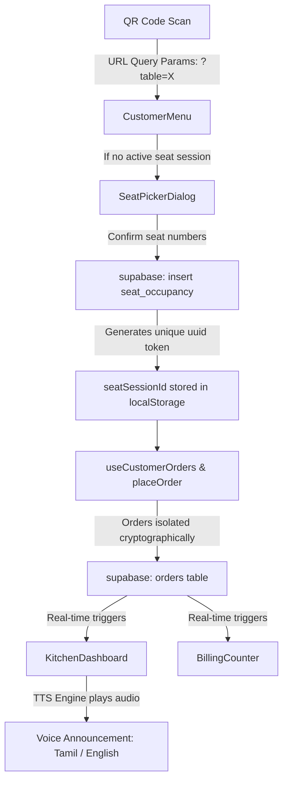

# Zappy - Premium Restaurant OS Updates (Since 3:09 PM Today)

All files modified, added, or deleted since **3:09 PM (15:09:00)** today, along with their last write times and the system data-flow diagram.

---

## 📂 File Updates & Creations (After 3:09 PM)

### 🆕 New Files Added
* **Database & Migrations**:
  * [`supabase/migrations/20260622000000_smart_table_occupancy.sql`](file:///c:/Users/Rishi/Downloads/Zappy/supabase/migrations/20260622000000_smart_table_occupancy.sql) *(16:11)* — Set up the `seat_occupancy` table and triggers.
  * [`supabase/migrations/20260622000001_order_session_isolation.sql`](file:///c:/Users/Rishi/Downloads/Zappy/supabase/migrations/20260622000001_order_session_isolation.sql) *(16:30)* — Cryptographic seat session binding for orders.
* **Hooks**:
  * [`src/hooks/useVoiceAnnouncement.ts`](file:///c:/Users/Rishi/Downloads/Zappy/src/hooks/useVoiceAnnouncement.ts) *(16:03)* — TTS announcer for Tamil & English kitchen notifications.
* **Landing Revamp & Legal Pages**:
  * [`src/pages/landing/AboutUs.tsx`](file:///c:/Users/Rishi/Downloads/Zappy/src/pages/landing/AboutUs.tsx) *(15:58)*
  * [`src/pages/landing/Careers.tsx`](file:///c:/Users/Rishi/Downloads/Zappy/src/pages/landing/Careers.tsx) *(15:50)*
  * [`src/pages/landing/Features.tsx`](file:///c:/Users/Rishi/Downloads/Zappy/src/pages/landing/Features.tsx) *(15:49)*
  * [`src/pages/landing/GuestExperience.tsx`](file:///c:/Users/Rishi/Downloads/Zappy/src/pages/landing/GuestExperience.tsx) *(15:49)*
  * [`src/pages/legal/CookiePolicy.tsx`](file:///c:/Users/Rishi/Downloads/Zappy/src/pages/legal/CookiePolicy.tsx) *(15:49)*
  * [`src/pages/legal/PrivacyPolicy.tsx`](file:///c:/Users/Rishi/Downloads/Zappy/src/pages/legal/PrivacyPolicy.tsx) *(15:49)*
  * [`src/pages/legal/TermsOfService.tsx`](file:///c:/Users/Rishi/Downloads/Zappy/src/pages/legal/TermsOfService.tsx) *(15:49)*

### ✏️ Modified Files
* **Customer Menu & Ordering Flow**:
  * [`src/pages/CustomerMenu.tsx`](file:///c:/Users/Rishi/Downloads/Zappy/src/pages/CustomerMenu.tsx) *(17:20)* — Main customer experience, seat confirmation, and order handling.
  * [`src/components/menu/SeatPickerDialog.tsx`](file:///c:/Users/Rishi/Downloads/Zappy/src/components/menu/SeatPickerDialog.tsx) *(16:16)* — Seating selections.
  * [`src/hooks/useCustomerOrders.ts`](file:///c:/Users/Rishi/Downloads/Zappy/src/hooks/useCustomerOrders.ts) *(17:10)* — Isolating orders per seat session.
  * [`src/hooks/useTables.ts`](file:///c:/Users/Rishi/Downloads/Zappy/src/hooks/useTables.ts) *(16:25)*
* **Kitchen & Admin Dashboards**:
  * [`src/pages/KitchenDashboard.tsx`](file:///c:/Users/Rishi/Downloads/Zappy/src/pages/KitchenDashboard.tsx) *(16:04)* — Real-time TTS announcers for new orders.
  * [`src/components/admin/KitchenOrderCard.tsx`](file:///c:/Users/Rishi/Downloads/Zappy/src/components/admin/KitchenOrderCard.tsx) *(17:26)* — Refactored to support React `forwardRef` to eliminate Framer Motion warnings.
  * [`src/pages/BillingCounter.tsx`](file:///c:/Users/Rishi/Downloads/Zappy/src/pages/BillingCounter.tsx) *(16:32)*
  * [`src/components/admin/TableManagement.tsx`](file:///c:/Users/Rishi/Downloads/Zappy/src/components/admin/TableManagement.tsx) *(16:55)*
  * [`src/components/admin/CategoryManager.tsx`](file:///c:/Users/Rishi/Downloads/Zappy/src/components/admin/CategoryManager.tsx) *(16:36)*
* **Landing Assets & Routing**:
  * [`src/App.tsx`](file:///c:/Users/Rishi/Downloads/Zappy/src/App.tsx) *(15:47)*
  * [`src/pages/LandingPage.tsx`](file:///c:/Users/Rishi/Downloads/Zappy/src/pages/LandingPage.tsx) *(15:54)*
  * [`src/components/landing/Footer.tsx`](file:///c:/Users/Rishi/Downloads/Zappy/src/components/landing/Footer.tsx) *(15:47)*
  * [`public/sitemap.xml`](file:///c:/Users/Rishi/Downloads/Zappy/public/sitemap.xml) *(15:55)*
* **Supabase Integration**:
  * [`src/integrations/supabase/types.ts`](file:///c:/Users/Rishi/Downloads/Zappy/src/integrations/supabase/types.ts) *(17:02)*
* **Metadata**:
  * [`AGENTS.md`](file:///c:/Users/Rishi/Downloads/Zappy/AGENTS.md) *(17:07)*

---

## 🔀 System Data Flow

